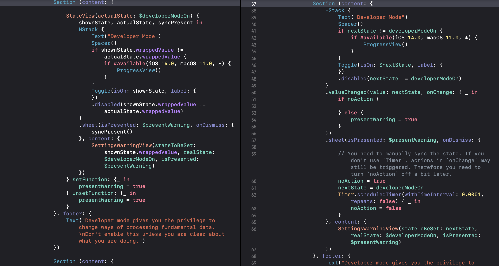

# StateView
A SwiftUI View that simplifies the management of async states of toggles or so.

用优雅的方式处理SwiftUI中状态切换的异步处理。

# 前言 Intro
## Have you ever met...
When the user turns the switch on or off, you need to go through a series of processes before changing the actual state.

For example, you need to communicate with the server and wait to receive a return value before you can confirm that the change was successful and then reflect it on the switch.

In this case, the displayed state of the switch is not the same as the actual state. The user turns it on, but the function is not actually turned on yet.
If you use Toggle provided by SwiftUI, you must provide a variable binded to the display state of Toggle. In fact, all you want is to do some further processing when the user switches states. Managing an extra variable and putting it in your View is just a hassle.

But that's not the end of the disaster: In SwiftUI, your further processing is usually placed in 'onChange', which binds the corresponding variable to the display state. If you sync the actual state directly to the display state, for example, the user turns the toggle on, but the operation fails, you need to sync the OFF state back to display state. The closure in `onChange` is called again. So you have to add an extra variable, or an extra conditional statement to handle this situation.

Things get worse, when you have multiple Toggles in your View that require asynchronous operations mentioned above. You will have to perform such operations on each of them.

StateView provides an elegant way to help you handle this.

[English Document](#english)
## 你有没有遇到过...
当用户打开或关闭开关的时候，你需要进行一系列处理才能更改实际的状态。

比如，需要先与服务器通信，收到返回值才能确定更改成功并反映在开关上。

在这种情况下，开关的显示状态与实际的状态并不相同。用户打开了，但实际上还没打开。如果使用 SwiftUI 提供的 Toggle，你必须提供一个变量绑定 Toggle 的显示状态。实际上，你需要的只是在用户切换状态后进行进一步的处理，额外管理一个变量并放到你的 View 里只是一个累赘。

但灾难还不仅如此：在 SwiftUI 中，你的进一步的处理一般都会放在 `onChange` 里，其中绑定对应的显示状态的变量。如果直接将实际状态同步到显示状态，比如用户打开了，但切换失败了，你需要将关闭状态同步回去。这个时候就会再次调用 `onChange` 里的闭包。因此，你不得不额外加一个变量，或者额外进行条件判断。更灾难的是，如果你的 View 中有多个需要异步操作的 Toggle，你不得不对每一个 Toggle 都执行这样的操作。

StateView 可以帮你优雅地解决这个问题。
[中文文档](#chinese-document)

# 安装 Installation

### SPM安装方法 Install via SPM

```
https://github.com/richardjorne/StateViewSPM.git
```

### 或者 Alternatively
直接复制 `/StateView/StateView.swift` 到你的工程中即可。

Directly copy `/StateView/StateView.swift` to your workspace directory.


# 使用示例 Example Usage

```swift
...
@State private var developerModeOn: Bool = false
@State private var presentWarning: Bool = false
...
StateView(actualState: $developerModeOn) { shownState, actualState, syncPresent in
    HStack {
        Text("Developer Mode")
        Spacer()
        if shownState.wrappedValue != actualState.wrappedValue {
            ProgressView()
        }
        Toggle(isOn: shownState, label: {
        })
        .disabled(shownState.wrappedValue != actualState.   wrappedValue)
    }
    .sheet(isPresented: $presentWarning, onDismiss: {
        syncPresent()
    }, content: {
        SettingsWarningView(stateToBeSet: shownState.   wrappedValue, realState: $developerModeOn, isPresented:    $presentWarning)
    })
} setFunction: {_ in
    presentWarning = true
} unsetFunction: {_ in 
    presentWarning = true
}
```

具体请参考 
See details at
`/StateView/StateViewExampleView.swift`

# 使用前后对比 Comparison with and without StateView




<span id="chinese-document"></span>
# 中文文档
## 定义
```swift
StateView(
    actualState: Binding<Bool>,
    stateContentView: (Binding<Bool>, Binding<Bool>, () -> Void) -> Content,
    setFunction: (() -> Void) -> Void,
    unsetFunction: (() -> Void) -> Void
    )
```
看起来有点多，我们一点点拆解。

## 参数解释
- `actualState`: 程序真正的状态。比如说，如果数据库中存储的值是`false`，你正在将其更新到`true`，但还没更新完成，真正的状态还是`false`，那么存储`false`的那个变量就是真正的状态。

- `stateContentView`: 一个构建展示目前状态的ViewBuilder。比如说，你可以在其中传入一个Toggle，它的值随用户的想法而改变。
举例：用户想把`stateContentView`中的 Toggle 从关闭状态切换到打开状态，因此点按 Toggle。Toggle 状态随之切换为开启。
哪怕在真正开关这个功能之前还需要执行一系列事项，Toggle 状态依然会立刻在用户点按之后变化。在这种情况下，Toggle展示“将要切换到的状态”。[ViewBuilder闭包的参数解释](#viewbuilder-parameter-explanation-ch)

- `setFunction`: 当用户尝试开启的时候需要执行的内容。该函数提供上述提到的 `syncPresent` 函数。
- `unsetFunction`: 当用户尝试关闭的时候需要执行的内容。该函数提供上述提到的 `syncPresent` 函数。

<span id="viewbuilder-parameter-explanation-ch"></span>
#### ViewBuilder 闭包提供了三个参数来帮你构建 `stateContentView`，你需要捕获他们。

- `shownState` 是展示在屏幕上的状态，也就是例子中 Toggle 的状态。
- `actualState` 是真正的状态，与你传入的第一个参数是一样的。
- `syncPresent` 是用来将真正状态同步到展示状态的函数。比如说，当用户尝试打开开关，你要求用户进行二次确认。此时如果用户取消（选择不开启），显示的开关就应该从开启变为关闭状态（也就是真正状态）。在这种情况下你需要使用这个函数进行同步。

<!-- ### 警告: ```shownState.wrappedValue = actualState.wrappedValue``` 这样的代码可能导致预料之外的行为。你应该总是使用闭包中提供的`syncPresent`函数。 -->


### Richard Jorne 其他的 SwiftUI 组件库：

[RingRangeSelector](https://github.com/richardjorne/RingRangeSelector)

[Wave](https://github.com/richardjorne/Wave)

祝你度过愉快的一天！

此致

Richard Jorne


<span id="english"></span>

# English Document

## Definition
```swift
StateView(
    actualState: Binding<Bool>,
    stateContentView: (Binding<Bool>, Binding<Bool>, () -> Void) -> Content,
    setFunction: (() -> Void) -> Void,
    unsetFunction: (() -> Void) -> Void
    )
```

## Parameter Explanation
- `actualState`: The actual state of the program. For example, if the data in the database is `false`, and is yet to be updated to `true`, then the variable that
holds the value `false` is the actual state.
- `stateContentView`: A ViewBuilder function that builds the view you need to present the current state. For example, you can put a toggle that can interact with the
user and show the state that the user want it to be. 
E.g., the user wants to turn the function on so they tap to turn the Toggle in this closure on.
Although there are still things to be done before the specific function is really turned on, the state of the Toggle is immediately turned on once the user does
so. In this case, the toggle represents the state that is about to be changed to. [ViewBuilder closure parameter explanation](#viewbuilder-parameter-explanation-en)
- `setFunction`: Things to do when the user attempts to turn the toggle on, with a `syncPresent` function mentioned in the discussion.
- `unsetFunction`: Things to do when the user attempts to turn the toggle off, with a `syncPresent` function mentioned in the discussion.

<span id="viewbuilder-parameter-explanation-en"></span>

#### The ViewBuilder closure provides three parameters to help you construct your `stateContentView`. You may capture them in the closure.
- `shownState` is the state shown on the screen, i.e. the state of the toggle in the example.
- `actualState` is the actual state, which is identical to what you passed into the first parameter.
- `syncPresent` is the function you can use to sync the actual state to the shown state. For example, when the user turns the toggle on and you ask the user to confirm. If the
user choose not to confirm(dismiss the window or tap on Cancel button), then the toggle state should be changed back to `false`, which is the same to the actual state. In this situation, you use this function to sync the state.


### Other SwiftUI Libraries by Richard Jorne：

My first project: [RingRangeSelector](https://github.com/richardjorne/RingRangeSelector)

My second project: [Wave](https://github.com/richardjorne/Wave)

Wish you a nice day!

Best,

Richard Jorne